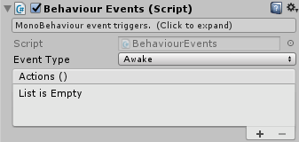
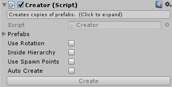
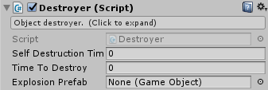
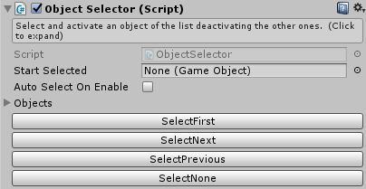
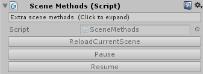
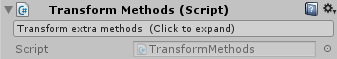

## Welcome to Game Booster Docs

**Game Booster** is a set of scripts to create your game. It has a lot of daily common logic to accelerate your development. There is components to deal with movement, instantiation, destruction, input, score, and lot more.

The main principle of **Game Booster** is reusability. To achieve this, each component do simple things, and can be connected with others components (even your scripts) to achieve more complex behaviours. Many scripts has UnityEvent fields, which allows you to connect some event with other object’s methods and attributes on your scene.

The components> are splitted in several categories: Basics, Movement, Physics, Collision Detection, Input, Time, Vars, Score, Mechanics and Audio.

- [Basics components](#basics-components)
  - [BehaviourEvents](#behaviourevents)
  - [Creator](#creator)
  - [Destroyer](#destroyer)
  - [ObjectSelector](#objectselector)
  - [SceneMethods](#scenemethods)
  - [TransformMethods](#transformmethods)
- [Input components](#input-components)
  - [AxisInput](#axisinput)
  - [KeyInput](#keyinput)
  - [MousePositionInput](#mousepositioninput)
- [Movement components](#movement-components)


## Basics components

Basics components deal with fundamental logic in Game Booster

### BehaviourEvents



Creates events for each MonoBehaviour events like Awake, Start, Update, OnEnable, etc. This component helps you to put simple logic in some MonoBehaviour event without creating a new script to it.

Fields:
- **Enum eventType** : Enum of each event will be received
- **UnityEvent actions** : Events that will be called when the event set in EventType happens

### Creator



Creates instance of prefabs. Randomically choose one prefab from the list to be instantiated at some spawn point.

Fields:
- **List\<GameObject\> prefabs** : Prefabs to be instantiated (random choosen).
- **bool useRotation** : Use spawn point rotation as rotation of the instantiated object
- **bool insideHierarchy** : Place the instantiated object inside other object's hierarchy
  - **Transform parent** : Object to put the instantiated objects
- **bool useSpawnPoints** : Use other spawn points instead of this object
  - **List\<Transform\> spawnPoints** : Spawn points where the prefab will be instantiated (random choosen)
- **bool autoCreate** : Automatically instantiate
  - **float startTime** : Time to start prefab instantiation
  - **float repeatTime** : Time between instantiations

Methods:
- **void Create()** : Instantiate a prefab using the options set

### Destroyer



This component has a few ways to destroy the object it is attached to.

Fields:
- **float selfDestructionTime** : Time to self destruction. Set 0(zero) to disable.
- **float timeToDestroy** : Time to destroy when 'DestroyThis' method is called
- **GameObject explosionPrefab** : Prefab to replace the destroyed object

Methods:
- **void DestroyThis()** : destroy this object including all options set
- **void DestroyThisNow()** : destroy this object ignoring timeToDestroy option
- **void DestroyThisWithoutExplosion()** : destroy this object ignoring explosion
- **void JustDestroyThis()** : destroy this object ignoring all options

### DestroyerX


This component has a few ways to destroy the object it is attached to.

Fields:
- `float selfDestructionTime` : Time to self destruction. Set 0(zero) to disable.
- `float timeToDestroy` : Time to destroy when 'DestroyThis' method is called
- `GameObject explosionPrefab` : Prefab to replace the destroyed object

Methods:
- `void DestroyThis()` : destroy this object including all options set
- `void DestroyThisNow()` : destroy this object ignoring timeToDestroy option
- `void DestroyThisWithoutExplosion()` : destroy this object ignoring explosion
- `void JustDestroyThis()` : destroy this object ignoring all options

### ObjectSelector



Selects one object of a list, activating it, and deactivating the others of the list. Can be used to switch between weapons, costumes, screens, etc.

Fields:
- **GameObject startSelected** : Selected object at start
- **bool autoSelectOnEnable** : Select the 'startSelected' object on OnEnable event occours
- **List\<GameObject\> objects** : Selectable objects

Methods:
- **void SelectFirst()** : selects the first object of the list
- **void SelectNext()** : selects the next object of the list, after the current selected
- **void SelectPrevious()** : selects the previous object of the list, before the current selected
- **void SelectNone()** : deselects all objects (deactivating all)
- **void Select(GameObject obj)** : selects the object passed as parameter
- **void Select(string name)** : selects the object of the list with the name passed as parameter
- **void Select(int index)** : selects the object of the list at the position passed as parameter

### SceneMethods



Gives access to static methods relative to the scene. This component don’t add features, just gives access point to static methods and properties to be called via events by other components.

Methods:
- **void LoadScene(string sceneName)** : load another scene
- **void ReloadCurrentScene()** : reload current scene
- **void ApplicationQuit()** : quit application
- **void Pause()** : set Time.timeScale = 0
- **void Resume()** : set Time.timeScale = 1

### TransformMethods



Methods and properties to set only one axis of position/scale/rotation and copy position/scale/rotation from other transform.

Properties:
- **float positionX** : set position.x value
- **float positionY** : set position.y value
- **float positionZ** : set position.z value
- **float localPositionX** : set localPosition.x value
- **float localPositionY** : set localPosition.y value
- **float localPositionZ** : set localPosition.z value
- **Vector2 positionXY** : set position.x and position.y values
- **Vector2 localPositionXY** : set localPosition.x and localPosition.y values
- **float localScaleX** : set localScale.x value
- **float localScaleY** : set localScale.y value
- **float localScaleZ** : set localScale.z value
- **float eulerAnglesX** : set eulerAngles.x value
- **float eulerAnglesY** : set eulerAngles.y value
- **float eulerAnglesZ** : set eulerAngles.z value
- **float localEulerAnglesX** : set localEulerAngles.x value
- **float localEulerAnglesY** : set localEulerAngles.y value
- **float localEulerAnglesZ** : set localEulerAngles.z value

Methods:
- **void SetPositionFrom(Transform target)** : copy position from target transform
- **void SetLocalPositionFrom(Transform target)** : copy localPosition from target transform
- **void SetRotationFrom(Transform target)** : copy rotation from target transform
- **void SetLocalRotationFrom(Transform target)** : copy localRotation from target transform
- **void SetLocalScaleFrom(Transform target)** : copy localScale from target transform

## Input components

Components to get player's input.

### AxisInput

### KeyInput
### MousePositionInput

## Movement components


## Physics components
## Collision Detection components
## Time components
## Vars components
## Score components
## Mechanics components
## Audio components


You can use the [editor on GitHub](https://github.com/raphaelmarques2/GameBoosterDocs/edit/master/README.md) to maintain and preview the content for your website in Markdown files.

Whenever you commit to this repository, GitHub Pages will run [Jekyll](https://jekyllrb.com/) to rebuild the pages in your site, from the content in your Markdown files.

### Markdown

Markdown is a lightweight and easy-to-use syntax for styling your writing. It includes conventions for

```markdown
Syntax highlighted code block

# Header 1
## Header 2
### Header 3

- Bulleted
- List

1. Numbered
2. List

**Bold** and _Italic_ and `Code` text

[Link](url) and 
```
For more details see [GitHub Flavored Markdown](https://guides.github.com/features/mastering-markdown/).

### Jekyll Themes

Your Pages site will use the layout and styles from the Jekyll theme you have selected in your [repository settings](https://github.com/raphaelmarques2/GameBoosterDocs/settings). The name of this theme is saved in the Jekyll `_config.yml` configuration file.

### Support or Contact

Having trouble with Pages? Check out our [documentation](https://help.github.com/categories/github-pages-basics/) or [contact support](https://github.com/contact) and we’ll help you sort it out.
