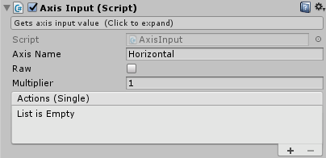
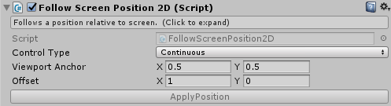
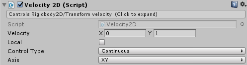
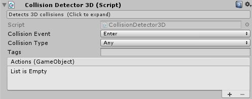
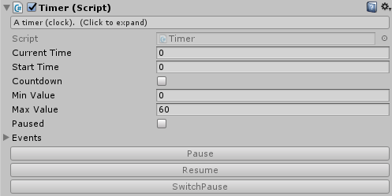

## Welcome to Game Booster Docs

**Game Booster** is a set of scripts to create your game. It has a lot of daily common logic to accelerate your development. There is components to deal with movement, instantiation, destruction, input, score, and lot more.

The main principle of **Game Booster** is reusability. To achieve this, each component do simple things, and can be connected with others components (even your scripts) to achieve more complex behaviours. Many scripts has UnityEvent fields, which allows you to connect some event with other object’s methods and attributes on your scene.

The components> are splitted in several categories: Basics, Movement, Physics, Collision Detection, Input, Time, Vars, Score, Mechanics and Audio.

- [Basics components](#basics-components)
  - [BehaviourEvents](#behaviourevents)
  - [Creator](#creator)
  - [Destroyer](#destroyer)
  - [ObjectSelector](#objectselector)
  - [SceneMethods](#scenemethods)
  - [TransformMethods](#transformmethods)
- [Input components](#input-components)
  - [AxisInput](#axisinput)
  - [KeyInput](#keyinput)
  - [MousePositionInput](#mousepositioninput)
- [Movement components](#movement-components)

## Basics components

Basics components deal with fundamental logic in Game Booster

### BehaviourEvents

Creates events for each MonoBehaviour events like Awake, Start, Update, OnEnable, etc. This component helps you to put simple logic in some MonoBehaviour event without creating a new script to it.

Fields:
- `Enum eventType` : Enum of each event will be received
- `UnityEvent actions` : Events that will be called when the event set in EventType happens

### Creator

Creates instance of prefabs. Randomically choose one prefab from the list to be instantiated at some spawn point.

Fields:
- `List<GameObject> prefabs` : Prefabs to be instantiated (random choosen).
- `bool useRotation` : Use spawn point rotation as rotation of the instantiated object
- `bool insideHierarchy` : Place the instantiated object inside other object's hierarchy
  - `Transform parent` : Object to put the instantiated objects
- `bool useSpawnPoints` : Use other spawn points instead of this object
  - `List<Transform> spawnPoints` : Spawn points where the prefab will be instantiated (random choosen)
- `bool autoCreate` : Automatically instantiate
  - `float startTime` : Time to start prefab instantiation
  - `float repeatTime` : Time between instantiations

Methods:
- `void Create()` : Instantiate a prefab using the options set

### Destroyer

This component has a few ways to destroy the object it is attached to.

Fields:
- `float selfDestructionTime` : Time to self destruction. Set 0(zero) to disable.
- `float timeToDestroy` : Time to destroy when 'DestroyThis' method is called
- `GameObject explosionPrefab` : Prefab to replace the destroyed object

Methods:
- `void DestroyThis()` : destroy this object including all options set
- `void DestroyThisNow()` : destroy this object ignoring timeToDestroy option
- `void DestroyThisWithoutExplosion()` : destroy this object ignoring explosion
- `void JustDestroyThis()` : destroy this object ignoring all options

### ObjectSelector

Selects one object of a list, activating it, and deactivating the others of the list. Can be used to switch between weapons, costumes, screens, etc.

Fields:
- `GameObject startSelected` : Selected object at start
- `bool autoSelectOnEnable` : Select the 'startSelected' object on OnEnable event occours
- `List\<GameObject\> objects` : Selectable objects

Methods:
- `void SelectFirst()` : selects the first object of the list
- `void SelectNext()` : selects the next object of the list, after the current selected
- `void SelectPrevious()` : selects the previous object of the list, before the current selected
- `void SelectNone()` : deselects all objects (deactivating all)
- `void Select(GameObject obj)` : selects the object passed as parameter
- `void Select(string name)` : selects the object of the list with the name passed as parameter
- `void Select(int index)` : selects the object of the list at the position passed as parameter

### SceneMethods

Gives access to static methods relative to the scene. This component don’t add features, just gives access point to static methods and properties to be called via events by other components.

Methods:
- `void LoadScene(string sceneName)` : load another scene
- `void ReloadCurrentScene()` : reload current scene
- `void ApplicationQuit()` : quit application
- `void Pause()` : set Time.timeScale = 0
- `void Resume()` : set Time.timeScale = 1

### TransformMethods

Methods and properties to set only one axis of position/scale/rotation and copy position/scale/rotation from other transform.

Properties:
- `float positionX` : set position.x value
- `float positionY` : set position.y value
- `float positionZ` : set position.z value
- `float localPositionX` : set localPosition.x value
- `float localPositionY` : set localPosition.y value
- `float localPositionZ` : set localPosition.z value
- `Vector2 positionXY` : set position.x and position.y values
- `Vector2 localPositionXY` : set localPosition.x and localPosition.y values
- `float localScaleX` : set localScale.x value
- `float localScaleY` : set localScale.y value
- `float localScaleZ` : set localScale.z value
- `float eulerAnglesX` : set eulerAngles.x value
- `float eulerAnglesY` : set eulerAngles.y value
- `float eulerAnglesZ` : set eulerAngles.z value
- `float localEulerAnglesX` : set localEulerAngles.x value
- `float localEulerAnglesY` : set localEulerAngles.y value
- `float localEulerAnglesZ` : set localEulerAngles.z value

Methods:
- `void SetPositionFrom(Transform target)` : copy position from target transform
- `void SetLocalPositionFrom(Transform target)` : copy localPosition from target transform
- `void SetRotationFrom(Transform target)` : copy rotation from target transform
- `void SetLocalRotationFrom(Transform target)` : copy localRotation from target transform
- `void SetLocalScaleFrom(Transform target)` : copy localScale from target transform

## Input components

Components to get player's input.

### AxisInput

Gets axis input value.

Fields:
- `string axisName` : Axis name (ex: "Horizontal", "Vertical" )
- `bool raw` : Get input raw value
- `float multiplier` : Axis will be multiplied by this value
- `UnityEvent<float> actions` : event called at each frame passing axis value

### KeyInput

Gets key input events.

Fields:
- `EventType eventType` : Type of key event
- `KeyCode key` : Key code
- `UnityEvent<bool> actions` : event called when the key event happens

`EventType` enum values:
- `Pressed` : event is called when the key is pressed
- `Released` : event is called when the key is released
- `Repeat` : event is called each update

### MousePositionInput

Gets mouse position.

Fields:
- `PositionType positionType` : Mouse position coordinate.
- `UnityEvent<Vector2> actions` : events called each update passing the mouse position

`PositionType` enum values:
- `World2D` : mouse position in the world coordinates using a orthographic camera
- `Screen` : absolute mouse position in the screen
- `Viewport` : mouse position relative to screen from (0,0) at botton left to (1,1) at top right
- `CenteredViewport` : mouse position relative to screen with (0,0) at screen center

## Movement components

### AngularVelocity2D

Controls the Rigidbody2D/Transform angular velocity.

Fields:
- `float velocity` : 
- `ControlType controlType` : 

Methods:
- `void ApplyVelocity()` : apply the velocity to the Rigidbody2D/Transform

`ControlType` enum values:
- `Continuous` : angular velocity is continuous set
- `OnStart` : angular velocity is set on `Start` event
- `OnEnable` : angular velocity is set on `OnEnable` event
- `Manual` : angular velocity is set when the method `ApplyVelocity()` is called

### AngularVelocity3D

Controls the Rigidbody3D/Transform angular velocity.

Fields:
- `Vector3 angularVelocity` : Current angular velocity
- `float angularVelocityX` : Current x angular velocity
- `float angularVelocityY` : Current y angular velocity
- `float angularVelocityZ` : Current z angular velocity
- `ControlType controlType` : How the angular velocity is controled

Methods:
- `void ApplyVelocity()` : apply the velocity to the Rigidbody3D/Transform

`ControlType` enum values:
- `Continuous` : angular velocity is continuous set
- `OnStart` : angular velocity is set on `Start` event
- `OnEnable` : angular velocity is set on `OnEnable` event
- `Manual` : angular velocity is set when the method `ApplyVelocity()` is called

### FollowScreenPosition2D

Follows a position relative to screen.

Fields:
- `ControlType controlType` : How the position is controled
- `Vector2 viewportAnchor` : Screen viewport anchor (from 0.0 to 1.0)
- `Vector2 offset` : Position offset in world coordinates

Methods:
- `void ApplyPosition()` : apply the position relative to screen 

`ControlType` enum values:
- `Continous` : Apply position every frame
- `OnStart` : Apply position on `Start` event
- `OnEnable` : Apply position on `OnEnable` event
- `Manual` : Apply position when the method `ApplyPosition()` is called

### FollowTarget2D

Follows a target position.

Fields:
- `Transform target` : Target that will be followed
- `Vector2 offset` : Position offset from target
- `float speed` : Speed at which the object will move to target. Set 0(zero) to infinity speed.
- `Axis axis` : Axis affected by target position

`Axis` enum values:
- `XY` : affects x and y axis
- `X` : affects x axis
- `Y` : affects y axis

### FollowTarget3D

Follow a target position.

Fields:
- `Transform target` : Target that will be followed
- `Vector3 offset` : Position offset from target
- `float speed` : Speed at which the object will move to target. Set 0(zero) to infinity speed.
- `Axis axis` : Axis affected by target position

`Axis` enum values :
- `XYZ` : affects x, y and x axis
- `XY` : affects x and y axis
- `XZ` : affects x and z axis
- `YZ` : affects y and z axis
- `X` : affects x axis
- `Y` : affects y axis
- `Z` : affects z axis

### LookToTarget2D

Makes the object look (rotate) to some target.

Fields:
- `Transform target` : Target the object will look to.
- `float speed` : Angular speed at which the object will rotate. Set 0(zero) to infinity speed.
- `float angleOffset` : Angle offset to fix object rotation

### Velocity2D

Controls Rigidbody2D/Transform velocity.

Fields:
- `Vector2 velocity` : Current velocity
- `float velocityX` : Current x velocity
- `float velocityY` : Current y velocity
- `bool local` : Use object local orientation
- `ControlType controlType` : How the velocity is controlled
- `Axis axis` : Axis affected

Methods:
- `void ApplyVelocity()` : Applies current velocity

`ControlType` enum values:
- `Continous` : Apply velocity every frame
- `OnStart` : Apply velocity on `Start` event
- `OnEnable` : Apply velocity on `OnEnable` event
- `Manual` : Apply velocity when the method `ApplyVelocity()` is called

`Axis` enum values:
- `XY` : affects x and y axis
- `X` : affects x axis
- `Y` : affects y axis

### Velocity3D

Controls Rigidbody3D/Transform velocity.

Fields:
- `Vector3 velocity` : Current velocity
- `float velocityX` : Current x velocity
- `float velocityY` : Current y velocity
- `float velocityZ` : Current z velocity
- `bool local` : Use object local orientation
- `ControlType controlType` : How the velocity is controlled
- `Axis axis` : Axis affected

Methods:
- `void ApplyVelocity()` : Applies current velocity

`ControlType` enum values:
- `Continous` : Apply velocity every frame
- `OnStart` : Apply velocity on `Start` event
- `OnEnable` : Apply velocity on `OnEnable` event
- `Manual` : Apply velocity when the method `ApplyVelocity()` is called

`Axis` enum values :
- `XYZ` : affects x, y and x axis
- `XY` : affects x and y axis
- `XZ` : affects x and z axis
- `YZ` : affects y and z axis
- `X` : affects x axis
- `Y` : affects y axis
- `Z` : affects z axis

## Physics components

### Ridigbody2DMethods

Extra methods to control Rigidbody2D.

Fields:
- `float velocityX` : set x velocity
- `float velocityY` : set y velocity

Methods:
- `void InvertVelocity()` : inverts rigidbody velocity (velocity = -velocity)
- `void InvertVelocityX()` : inverts rigidbody x velocity (velocity.x = -velocity.x)
- `void InvertVelocityY()` : inverts rigidbody y velocity (velocity.y = -velocity.y)
- `void InvertAngularVelocity()` : inverts rigidbody angular velocity (angularVelocity = -angularVelocity)
- `void NormalizeVelocity(float speed)` : normalizes rigidbody velocity (velocity = velocity.normalized * speed

### RidigbodyMethods

Extra methods to control Rigidbody.

Fields:
- `float velocityX` : set x velocity
- `float velocityY` : set y velocity
- `float velocityZ` : set z velocity
- `float angularVelocityX` : set x angular velocity
- `float angularVelocityY` : set y angular velocity
- `float angularVelocityZ` : set z angular velocity

Methods:
- `void InvertVelocity()` : inverts rigidbody velocity (velocity = -velocity)
- `void InvertVelocityX()` : inverts rigidbody x velocity (velocity.x = -velocity.x)
- `void InvertVelocityY()` : inverts rigidbody y velocity (velocity.y = -velocity.y)
- `void InvertVelocityZ()` : inverts rigidbody z velocity (velocity.z = -velocity.z)
- `void InvertAngularVelocityX()` : inverts rigidbody angular velocity x (angularVelocity.x = -angularVelocity.x)
- `void InvertAngularVelocityY()` : inverts rigidbody angular velocity y (angularVelocity.y = -angularVelocity.y)
- `void InvertAngularVelocityZ()` : inverts rigidbody angular velocity z (angularVelocity.z = -angularVelocity.z)
- `void NormalizeVelocity(float speed)` : normalizes rigidbody velocity (velocity = velocity.normalized * speed
- `void NormalizeVelocityXY(float speed)()` : normalizes rigidbody velocity xy
- `void NormalizeVelocityXZ(float speed)()` : normalizes rigidbody velocity xz
- `void NormalizeVelocityYZ(float speed)()` : normalizes rigidbody velocity yz

### SpeedLimit2D

Limits the rididbody speed below a value.

Fields:
- `float maxSpeed` : Maximum speed allowed

### SpeedLimit3D

Limits the rididbody speed below a value.

Fields:
- `float maxSpeed` : Maximum speed allowed

## Collision Detection components

### CollisionDetector2D

Detects 2D collisions.

Fields:
- `CollisionEvent collisionEvent` : Collision event
- `CollisionType collisionType` : Collider type
- `string tags` : Tags to filter collision. Use ';' to separate more tags.
- `UnityEvent<GameObject> actions` : Event called when a collision occurs

`CollisionEvent` enum values:
- `Enter` : When this rigidbody/collider has begun touching another rigidbody/collider
- `Exit` : When this rigidbody/collider has stopped touching another rigidbody/collider
- `Stay` : Once per frame for every collider/rigidbody that is touching rigidbody/collider

`CollisionType` enum values:
- `Any` : Collision and Trigger events
- `Collision` : Only collision events (non trigger)
- `Trigger` : Only trigger events

### CollisionDetector3D

Detects 3D collisions.

Fields:
- `CollisionEvent collisionEvent` : Collision event
- `CollisionType collisionType` : Collider type
- `string tags` : Tags to filter collision. Use ';' to separate more tags.
- `UnityEvent<GameObject> actions` : Event called when a collision occurs

`CollisionEvent` enum values:
- `Enter` : When this rigidbody/collider has begun touching another rigidbody/collider
- `Exit` : When this rigidbody/collider has stopped touching another rigidbody/collider
- `Stay` : Once per frame for every collider/rigidbody that is touching rigidbody/collider

`CollisionType` enum values:
- `Any` : Collision and Trigger events
- `Collision` : Only collision events (non trigger)
- `Trigger` : Only trigger events

## Time components

### TimedActions

Executes actions repeatedly over time.

Fields:
- `float startTime` : Time to wait before the first execution starts
- `float repeatTime` : Time between two executions
- `UnityEvent actions` : Events called

### TimedActionSequence

Executes a sequence of actions with time between them.

Fields:
- `TimedAction[] actions` : Actions to be executed
  - `TimedAction` :
    - `float waitTime` : Time to wait before execute
    - `UnityEvent actions` : Actions to execute
- `ControlType controlType` : How actions are executed
- `bool continuous` : Continuous execute actions

Methods:
- `void CallActions()` : Start execute actions

`ControlType` enum values:
- `OnStart` : Executes when `Start` event occurs
- `OnEnable` : Executes when `OnEnable` event occurs
- `Manual` : Executes when method `CallActions` is called

### Timer

A timer (clock).

Fields:
- `float currentTime` : Current time (seconds)
- `float startTime` : Initial time
- `bool countdown` : If the timer is countdown
- `float minValue` : Minimum timer value
- `float maxvalue` : Maximum timer value
- `bool paused` : If the timer is paused
- `TimerEvents events` : Timer events
  - `UnityEvent<float> onChange` : Event called when the timer value changes
  - `UnityEvent<float> onMinValue` : Event called when the timer reaches the min value
  - `UnityEvent<float> onMaxValue` : Event called when the timer reaches the max value
  - `int textDigits` : Digits to show at the OnChangeText event
  - `UnityEvent<string> onChangeText` : Event called when the timer value changes, passing a string as parameter

Methods:
- `void AddTime(float time)` : Adds some time to currentTime
- `void Pause()` : Pause the clock
- `void Resume()` : Resume the clock
- `void SwitchPause()` : Swith between Paused and Resumed clock

## Vars components

### IntVar

description

Fields:
- ` ` : 
- ` ` : 
- ` ` : 
- ` ` : 
- ` ` : 

Methods:
- `void ()` :
- `void ()` :
- `void ()` :
- `void ()` :
- `void ()` :

### IntVarRef

description

Fields:
- ` ` : 
- ` ` : 
- ` ` : 
- ` ` : 
- ` ` : 

Methods:
- `void ()` :
- `void ()` :
- `void ()` :
- `void ()` :
- `void ()` :

### FloatVar

description

Fields:
- ` ` : 
- ` ` : 
- ` ` : 
- ` ` : 
- ` ` : 

Methods:
- `void ()` :
- `void ()` :
- `void ()` :
- `void ()` :
- `void ()` :

### FloatVarRef

description

Fields:
- ` ` : 
- ` ` : 
- ` ` : 
- ` ` : 
- ` ` : 

Methods:
- `void ()` :
- `void ()` :
- `void ()` :
- `void ()` :
- `void ()` :

### BoolVar

description

Fields:
- ` ` : 
- ` ` : 
- ` ` : 
- ` ` : 
- ` ` : 

Methods:
- `void ()` :
- `void ()` :
- `void ()` :
- `void ()` :
- `void ()` :

### BoolVarRef

description

Fields:
- ` ` : 
- ` ` : 
- ` ` : 
- ` ` : 
- ` ` : 

Methods:
- `void ()` :
- `void ()` :
- `void ()` :
- `void ()` :
- `void ()` :

## Score components

### Score

description

Fields:
- ` ` : 
- ` ` : 
- ` ` : 
- ` ` : 
- ` ` : 

Methods:
- `void ()` :
- `void ()` :
- `void ()` :
- `void ()` :
- `void ()` :

### ScoreMaker

description

Fields:
- ` ` : 
- ` ` : 
- ` ` : 
- ` ` : 
- ` ` : 

Methods:
- `void ()` :
- `void ()` :
- `void ()` :
- `void ()` :
- `void ()` :

## Mechanics components

### MoveFourDirections2D

description

Fields:
- ` ` : 
- ` ` : 
- ` ` : 
- ` ` : 
- ` ` : 

Methods:
- `void ()` :
- `void ()` :
- `void ()` :
- `void ()` :
- `void ()` :

### Platform2D

description

Fields:
- ` ` : 
- ` ` : 
- ` ` : 
- ` ` : 
- ` ` : 

Methods:
- `void ()` :
- `void ()` :
- `void ()` :
- `void ()` :
- `void ()` :

### Tank2D

description

Fields:
- ` ` : 
- ` ` : 
- ` ` : 
- ` ` : 
- ` ` : 

Methods:
- `void ()` :
- `void ()` :
- `void ()` :
- `void ()` :
- `void ()` :

## Audio components

### AudioManager

description

Fields:
- ` ` : 
- ` ` : 
- ` ` : 
- ` ` : 
- ` ` : 

Methods:
- `void ()` :
- `void ()` :
- `void ()` :
- `void ()` :
- `void ()` :

### AudioManagerControl

description

Fields:
- ` ` : 
- ` ` : 
- ` ` : 
- ` ` : 
- ` ` : 

Methods:
- `void ()` :
- `void ()` :
- `void ()` :
- `void ()` :
- `void ()` :

